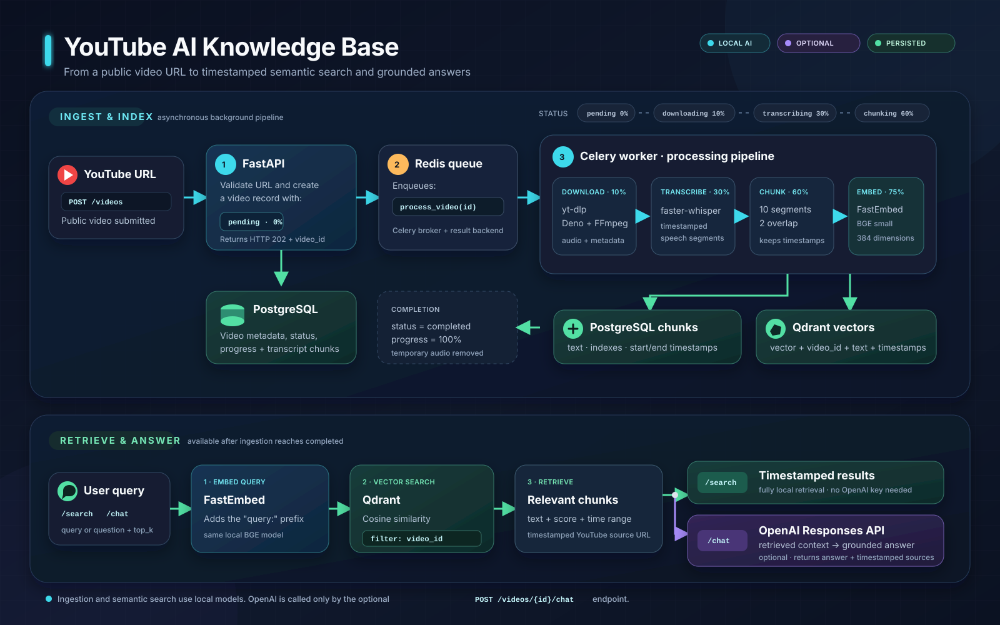

# YouTube AI Knowledge Base — FastAPI Backend

A backend-only demo that turns a YouTube video into a timestamped, searchable AI knowledge base.

## Architecture



The project has two connected paths:

1. **Ingest and index:** `POST /videos` creates a pending PostgreSQL record and
   queues a Celery task through Redis. The worker downloads the audio,
   transcribes it locally, builds overlapping timestamped chunks, embeds them,
   then stores chunk text and metadata in PostgreSQL and searchable vectors in
   Qdrant.
2. **Retrieve and answer:** both `/search` and `/chat` embed the user's query
   locally and retrieve chunks from Qdrant with a `video_id` filter. `/search`
   returns those timestamped results directly. `/chat` optionally sends only the
   retrieved context to the OpenAI Responses API and returns a grounded answer
   with the same sources.

The editable diagram source is
[`docs/assets/project-process.svg`](docs/assets/project-process.svg).

## Services

- **FastAPI** — HTTP API
- **Celery** — background video-processing worker
- **Redis** — Celery broker/result backend
- **PostgreSQL** — videos and transcript chunks
- **Qdrant** — vector database
- **yt-dlp (with its default EJS dependencies) + Deno + FFmpeg** — YouTube audio extraction
- **faster-whisper** — local transcription
- **FastEmbed** — local embeddings
- **OpenAI** — optional generated answer for `/chat`; `/search` does not require it

## Data model

### `videos`

One row per YouTube video.

### `video_chunks`

Many rows per video.

A chunk contains consecutive Whisper segments:

```text
Chunk 0 -> segments 0..9
Chunk 1 -> segments 8..17
Chunk 2 -> segments 16..25
```

For every chunk:

```text
chunk.start_time = first_segment.start
chunk.end_time   = last_segment.end
chunk.text       = combined segment text
```

The 2-segment overlap helps preserve context across chunk boundaries.

Qdrant uses **one collection for all video chunks**. Every vector has `video_id` in its payload, so searches are filtered to the selected video.

---

# Run locally

## 1. Requirements

Install:

- Docker
- Docker Compose v2

No local PostgreSQL, Redis, Qdrant, Whisper, or Python environment is required.

## 2. Configure environment

```bash
cp .env.example .env
```

The default setup works without an OpenAI key for ingestion and semantic search.

To enable `/chat`, edit `.env`:

```env
OPENAI_API_KEY=your_key_here
OPENAI_MODEL=gpt-5.5
```

## 3. Start everything

```bash
docker compose up --build
```

That single command starts:

- PostgreSQL
- Redis
- Qdrant
- FastAPI
- Celery worker

Alembic migrations run automatically before the API starts.

The first transcription and first search may take longer because the Whisper
and embedding models are downloaded into the shared `model_cache` Docker volume
at `/tmp/youtube-ai-knowledge-base/models`.

## 4. Open the API docs

Open:

```text
http://localhost:8000/docs
```

Qdrant dashboard:

```text
http://localhost:6333/dashboard
```

---

# API flow

## 1. Submit a YouTube video

```bash
curl -X POST http://localhost:8000/videos \
  -H "Content-Type: application/json" \
  -d '{
    "youtube_url": "https://www.youtube.com/watch?v=YOUR_VIDEO_ID"
  }'
```

Example response:

```json
{
  "video_id": "2bfef150-0198-4c7c-bcdc-244c840f9b91",
  "status": "pending",
  "message": "Video accepted for background processing."
}
```

Save the `video_id`.

## 2. Check status

```bash
curl http://localhost:8000/videos/VIDEO_ID/status
```

Possible states:

```text
pending
downloading
transcribing
chunking
embedding
completed
failed
```

Example:

```json
{
  "video_id": "2bfef150-0198-4c7c-bcdc-244c840f9b91",
  "status": "embedding",
  "progress": 75,
  "error_message": null
}
```

## 3. Search inside the video

Wait until status is `completed`.

```bash
curl -X POST http://localhost:8000/videos/VIDEO_ID/search \
  -H "Content-Type: application/json" \
  -d '{
    "query": "What does the video say about vector databases?",
    "top_k": 5
  }'
```

Example result:

```json
{
  "query": "What does the video say about vector databases?",
  "results": [
    {
      "chunk_id": "6b81be76-f4b7-4ed0-b54d-f5ac28624175",
      "chunk_index": 7,
      "text": "A vector database stores...",
      "start_time": 510.2,
      "end_time": 575.8,
      "score": 0.86,
      "source_url": "https://www.youtube.com/watch?v=...&t=510s"
    }
  ]
}
```

The returned URL jumps directly to the chunk's start time.

## 4. Chat with the video

Requires `OPENAI_API_KEY`.

```bash
curl -X POST http://localhost:8000/videos/VIDEO_ID/chat \
  -H "Content-Type: application/json" \
  -d '{
    "question": "Summarize how the video explains vector databases.",
    "top_k": 5
  }'
```

The backend:

1. Embeds the question locally.
2. Searches Qdrant for relevant chunks filtered by `video_id`.
3. Sends only the retrieved transcript context to the configured OpenAI model.
4. Returns the generated answer and timestamped source chunks.

## 5. List videos

```bash
curl http://localhost:8000/videos
```

## 6. Delete a video

```bash
curl -X DELETE http://localhost:8000/videos/VIDEO_ID
```

This removes:

- the video row from PostgreSQL
- related chunks via cascade
- matching vectors from Qdrant
- any remaining temporary local audio directory

---

# Important code path: timestamped chunking

The key logic is in:

```text
app/services/chunking.py
```

The flow is:

```python
group = segments[start_index : start_index + chunk_size]

chunk = TranscriptChunk(
    start_time=group[0].start,
    end_time=group[-1].end,
    text=" ".join(segment.text for segment in group),
)
```

With:

```env
CHUNK_SIZE_SEGMENTS=10
CHUNK_OVERLAP_SEGMENTS=2
```

you get:

```text
segments 0..9   -> chunk 0
segments 8..17  -> chunk 1
segments 16..25 -> chunk 2
```

---

# Useful Docker commands

Run in foreground:

```bash
docker compose up --build
```

Run detached:

```bash
docker compose up --build -d
```

Watch API logs:

```bash
docker compose logs -f api
```

Watch processing logs:

```bash
docker compose logs -f worker
```

Stop:

```bash
docker compose down
```

Stop and delete all persisted data/model caches:

```bash
docker compose down -v
```

---

# Configuration notes

## Temporary data and model cache

The API and worker use temporary filesystem paths by default:

```env
DATA_DIR=/tmp/youtube-ai-knowledge-base/videos
MODEL_CACHE_DIR=/tmp/youtube-ai-knowledge-base/models
```

`DATA_DIR` holds downloaded audio only while a video is being processed. The
worker removes that video's directory after successful ingestion.
`MODEL_CACHE_DIR` holds the downloaded Whisper and embedding models so later
requests can reuse them.

Docker mounts the shared `video_data` and `model_cache` volumes at these same
paths, allowing the API and worker containers to use consistent storage. The
volumes remain available across container restarts and are removed with:

```bash
docker compose down -v
```

## Whisper

Default:

```env
WHISPER_MODEL=base
WHISPER_DEVICE=cpu
WHISPER_COMPUTE_TYPE=int8
```

For better transcription quality, try:

```env
WHISPER_MODEL=small
```

or:

```env
WHISPER_MODEL=medium
```

Larger models require more memory and are slower on CPU.

This Compose setup intentionally defaults to CPU so it works with a normal Docker installation. GPU-enabled faster-whisper requires an NVIDIA-compatible container image and NVIDIA Container Toolkit configuration.

## Embeddings

Default:

```env
EMBEDDING_MODEL=BAAI/bge-small-en-v1.5
EMBEDDING_DIMENSION=384
```

If you change the embedding model to one with a different vector dimension, update `EMBEDDING_DIMENSION` and recreate the Qdrant collection/volume:

```bash
docker compose down -v
docker compose up --build
```
